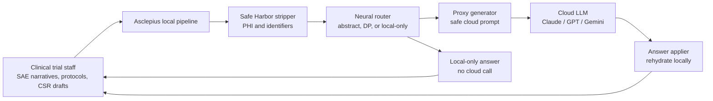

# Asclepius

**HackPrinceton Spring '26**

**Winner Best Overall Hack**  
**Winner AI Research and Alignment Environments by d_model**  
[$500 for 1st, $250 for 2nd, $125 for 3rd (Amazon gift cards)]  
**Winner AI & Tech for Clinical Trials by Regeneron**  
[Cash Prizes]

[Devpost](https://devpost.com/software/asclepius-4rthsu)

## How it works

## Inspiration
 
Every night, medical writers at pharma companies paste confidential clinical trial documents into ChatGPT to clean up the grammar. Pharmacovigilance specialists draft SAE narratives with patient quasi-identifiers in the prompt. Regulatory affairs teams paste FDA response letters to get help with wording. 58% of front-line health staff use unapproved AI tools for work, and 44% of them admit to including identifiable patient data at least occasionally.
 
The current options are bad. You can block the tools entirely, and staff route around you on personal devices. You can sign a BAA with an enterprise tier, but the sanctioned tools lag in capability, so people still use shadow AI for the hard stuff. You can run regex-based DLP, but it either over-redacts and destroys clinical meaning or under-redacts and leaks.
 
What's worse, compliance training focuses on the 18 HIPAA Safe Harbor identifiers — names, SSNs, MRNs — but the most damaging leakage in clinical trials isn't PHI at all. It's Material Non-Public Information: compound codenames that reveal a company's pipeline strategy, interim efficacy readouts that could move stock prices in the billions, amendment rationales that signal safety problems before the sponsor announces them. No regex catches *"ORR of 47% in the 200mg arm versus 22% in control."* That's the gap we set out to fill.
 
We expected to build a privacy tool and show it worked. What we actually built is a privacy tool **and** an adversarial harness that measures where and why it fails — and the failures turned out to be the interesting finding.
 
## What it does
 
Asclepius is a local privacy layer that sits between clinical trial staff and cloud LLMs (Claude, ChatGPT). It intercepts sensitive documents, processes them through a three-stage pipeline running entirely on-device, and forwards only a safe proxy to the cloud. The response comes back, original entities are re-applied locally, and the user gets a useful answer — without any PHI or proprietary IP ever leaving their machine.
 
The pipeline has three layers:
 
1. **Safe Harbor Stripper** — deterministic regex + local NER detection of all 18 HIPAA identifiers, replaced with tagged placeholders like `<PATIENT_NAME_1>`, `<DATE_2>`. The entity map is stored locally and never leaves the process.
2. **Neural Router** — a locally-running LLM classifies each request into one of three paths:
   - **Abstract-extractable** (~70% target): task intent can be expressed without any sensitive entities. The local model rewrites the query from scratch. The mapping is non-injective: multiple inputs produce the same synthesized query, making inversion mathematically impossible.
   - **DP-tolerant** (~20% target): the task needs some content but not exact values. Hidden-state embeddings are clipped to bounded L2 norm and perturbed with calibrated Gaussian noise, providing formal $(\varepsilon, \delta)$-differential privacy guarantees.
   - **Local-only** (~10% target): content and task are inseparable. The local model answers entirely on-device, nothing is sent to the cloud.
3. **Answer Applier** — the cloud LLM's response is returned locally, the entity map is re-applied longest-key-first to avoid partial-match collisions (`<PERSON_12>` before `<PERSON_1>`), and the final answer is shown to the user.
The DP mechanism uses Rényi DP accounting with per-session budget tracking. Noise scale is calibrated as:
 
$$\sigma = \frac{\Delta \cdot \sqrt{2 \ln(1.25/\delta)}}{\varepsilon}$$
 
where $\Delta = 1.0$ (L2 sensitivity after clipping) and $\delta = 10^{-5}$. At the default $\varepsilon = 3.0$, $\sigma \approx 1.61$. The system hard-refuses when the session privacy budget is exhausted.
 
Wrapped around the pipeline is a five-attack adversarial harness that measures text-surface privacy directly rather than trusting the mathematical guarantee — which turned out to be essential.
 
## How we built it
 
**Architecture.** A modular Python pipeline with strict separation of concerns. Every module — Safe Harbor stripper, router, query synthesizer, DP mechanism, proxy decoder, remote client, answer applier — is independently testable. All model calls (local LM and remote Anthropic) go through wrappers that enforce audit logging, canary detection, and hash-only output (no raw content in logs).
 
**Synthetic corpus.** 1,200 structurally realistic clinical trial documents across four types: Serious Adverse Event narratives (500), protocol excerpts (200), CRA monitoring visit reports (200), and Clinical Study Report drafts (300). Every document has ground-truth sensitive-span annotations with precise character offsets, covering 18 HIPAA categories plus clinical quasi-identifiers (compound codes, site IDs, doses, indications, efficacy values, AE grades) and MNPI categories (interim results, amendment rationales, regulatory questions). All content is visibly synthetic — investigators named "Dr. Testname Alpha," sites like "Synthetic Regional Medical Center."
 
**Attack suite.** Five adversarial classes, each evaluated at every iteration of the system:
 
- **A1. Verbatim scan** — literal + fuzzy substring matching of ground-truth spans against proxy text
- **A2. Cross-encoder similarity** — cosine similarity of proxy and original via `all-MiniLM-L6-v2`, with a 0.85 danger threshold
- **A3. Trained span inversion** — DistilBERT token classifier trained to recover sensitive spans from proxy text (our primary threat model)
- **A4. Membership inference** — logistic regression on proxy embeddings detecting whether a given entity appears in the source
- **A5. Utility regression** — LLM-as-judge scoring of proxy-answer quality vs. un-proxied-answer quality on downstream clinical tasks
**Frontend.** A VS-Code-style enterprise workspace: three resizable panes, two personas (Analyst for data exploration, Reviewer for safety-narrative drafting), a forensic dock at the bottom showing live ε accounting and a three-lane view of proxy sent → cloud response → rehydrated answer.
 
**Stack.** Python, PyTorch, Hugging Face Transformers, Anthropic SDK, sentence-transformers, Pydantic, FastAPI, React + TypeScript + D3. 74 passing tests. Every Python function carries a one-line docstring enforced by a pre-commit hook.
 
## Challenges we ran into
 
**The embedding–text privacy gap.** This is the headline finding, and it surfaced by accident. We swept ε across $\{0.5, 1.0, 2.0, 3.0, 5.0\}$ expecting to see a smooth privacy-utility curve. What we saw instead was utility of exactly **0.8598 at every ε to six decimal places**. The σ values ranged from 9.69 (at ε=0.5) to 0.97 (at ε=5.0) — a 10× variation. At ε=0.5, the injected noise had L2 magnitude roughly 438× the clipped signal. And the output text was **bit-identical**.
 
The diagnostic took a day to build and a minute to confirm: noise is injected correctly into the hidden state, but the proxy decoder ignores it. The decoder projects the noisy vector onto the vocabulary embedding matrix to extract top-k nearest tokens as soft hints, then passes them to a paraphrase prompt that explicitly tells the model hints can be discarded. Under greedy decoding (temperature 0) anchored to the placeholder-substituted input, the paraphrase is a deterministic function of the text — not of the hint. The $(\varepsilon, \delta)$-DP guarantee holds mathematically on the embedding. It does not propagate to the text surface. The decoder is ignoring the mechanism we built.
 
This is not an implementation bug. It's a structural mismatch between where DP is defined (vector representations) and where the adversary operates (token sequences). Any inference-time system that injects DP noise into a hidden state and decodes through an unmodified language model will face the same gap.
 
**Routing is the operative privacy control variable — not ε.** The verbatim attack revealed a 3.7× gap in leak rates between the two cloud-using paths on shared quasi-identifier categories. Abstract-extractable achieves 0.00 verbatim rate on efficacy_value; DP-tolerant achieves 0.67 on the same category at the same ε. The DP parameter is identical. Only the routing decision differs. Query synthesis is non-injective by construction (a synthesized question does not encode entity values, so no decoder can recover them); the DP path sends content through a paraphrase decoder that echoes quasi-identifiers verbatim from surrounding context.
 
**The privacy-utility tradeoff is binary, not smooth.** Once we saw the routing finding, we applied two targeted fixes: extended Safe Harbor regex for clinical quasi-identifiers (SITE_ID, COMPOUND_CODE, DOSE, AE_GRADE), plus a deterministic routing override that forces abstract-extractable whenever the span profile contains high-sensitivity categories. Results flipped: 10 of 14 verbatim categories went to 0.0%, semantic similarity dropped from 0.937 to 0.544, verbatim leak rate fell from 76.5% to 7.2%. Utility collapsed from 1.000 to 0.266. One architectural change produced all those effects through the same causal mechanism — abstract query synthesis loses the specific content the downstream task needed. The system does not interpolate between the two corners. The router is binary.
 
**Router fallback is unsafe by default.** 35% of protocol documents triggered a JSON parse error in the routing step, causing silent fallback to DP-tolerant — which our attacks had shown was the *weakest* privacy path. The system was failing open, not closed, and the log gave no signal.
 
**The utility metric lied.** In v1, the utility ratio was 1.000. The system "worked" by the utility metric while leaking 76.5% of sensitive spans verbatim. The utility metric and the privacy metrics were being measured on different paths: utility mostly on abstract-extractable corpora, privacy failures concentrated on DP-tolerant. Unifying the corpus in v2 made the tradeoff visible for the first time.
 
## Accomplishments that we're proud of
 
- **A mechanistic negative result that generalizes.** Formal $(\varepsilon, \delta)$-DP on hidden-state representations does not propagate to text-surface privacy under an unmodified decoder. We validated this across a 10× ε range with a diagnostic protocol that takes under a minute to run. This finding applies to any system with the same abstraction boundary — not just ours.
- **Five-attack adversarial harness with ground-truth labels.** Reproducible, seeded, covers verbatim and trained-inversion threat models that mathematical DP analysis cannot address. Usable as evaluation infrastructure for any future proxy-based LLM privacy system.
- **Route-disaggregated analysis.** We identified that aggregate privacy metrics conceal path-specific failures. The 3.7× path gap is invisible in overall statistics and only appears when you break results down by routing decision.
- **Honest v1→v2 comparison.** The v2 privacy gains came with a 73-point utility collapse. We report both, frame the tradeoff as a structural property of content-coupled tasks rather than a tunable parameter, and show a concrete path to a reachable interior (a learned proxy decoder that treats the noisy embedding as a hard constraint).
- **74 passing tests, canary-token leak detection, SHA-256-only audit logs.** The system audits itself — leak detection runs independently of whether the test suite reports green.
- **A synthetic corpus structurally faithful to clinical trial documents.** SAE narratives with CTCAE grading and ICH E2A causality fields, protocol excerpts with eligibility criteria and SAPs, monitoring reports with deviation tracking. Every sensitive category is enumerable and ground-truth-annotated.
## What we learned
 
**Mathematical DP guarantees are not evidence of text-surface privacy.** If you build anything that applies differential privacy to an intermediate representation and then decodes to text, you must measure the text directly. Vary ε across orders of magnitude and check whether the text actually changes. If it doesn't, the DP mechanism is disconnected from the observable surface, and any privacy claim attributed to it is wrong. We call this the *ε-invariance check* and recommend it as a necessary diagnostic for any future system in this class.
 
**DP noise is isotropic; decoder sensitivity is not.** The Gaussian noise we injected was spherical in the hidden-state space. The decoder's output is sensitive only to specific directions — mostly those that flip token-selection decisions at some decoding step. Noise energy in the output-invariant subspace is wasted privacy budget. An interpretability-informed DP mechanism would identify the output-relevant directions and concentrate noise there. This is where DP meets mechanistic interpretability, and we think it's the most promising direction forward.
 
**Routing dominates over noise.** In practice, the privacy behavior of a composed system like this is determined by the routing classifier, not the DP parameter. The router's calibration, its fallback policy on parse errors, its handling of edge cases — these are the first-order privacy levers. Tuning ε is a second-order concern once routing is correct. An organization evaluating an NGSP-like system for compliance should audit the router first.
 
**The biggest leakage risk in clinical trials isn't PHI — it's IP.** Staff are trained to avoid pasting patient names, but they don't think of compound codenames, interim efficacy data, or amendment rationales as "sensitive" in the same way. Compliance training doesn't cover it because it's not a HIPAA concern — it's a securities and IP concern governed by entirely different regulations. Deterministic de-identification is necessary but not sufficient. Regex catches SSNs and MRNs; it doesn't catch *"hazard ratio of 0.61 for PFS at the second interim analysis,"* and that's a billion-dollar sentence with no identifiers in it.
 
**Neural routing beats noise for IP protection.** Query synthesis — rewriting the task intent without any entity references — is more effective than adding noise to embeddings, because the mapping is non-injective by construction. You cannot invert a many-to-one function. But non-injectivity is also what causes the v2 utility collapse: abstract queries lose the specific content downstream tasks need. On content-coupled tasks (where the sensitive information *is* the task-relevant information), no proxy architecture can simultaneously satisfy both constraints. This is a structural property of the task class, not a defect we can tune away.
 
**Clinical trial documents are a well-defined privacy target.** The TMF Reference Model, ICH E6 GCP, and CTCAE grading system mean that every SAE narrative, protocol synopsis, and monitoring report follows a predictable structure. The sensitive categories are enumerable, the roles are identifiable, and the document types are consistent across the industry. This makes clinical trial privacy a tractable research problem in a way that general text privacy is not.
 
**An alignment point we didn't anticipate.** A system that promises "privacy-preserving clinical LLM assistance" without disclosing which task classes are content-coupled will, for those tasks, deliver either a privacy violation or a utility failure — silently picking one horn of the dilemma the user didn't know existed. A well-aligned system must detect content-coupled tasks at routing time and surface the tradeoff to the user. Asclepius as currently implemented doesn't do that. We treat it as a gap our successor design should address.
 
## What's next for Asclepius
 
- **Decoder-aware DP.** Perturbation along the decoder's output-sensitive directions rather than isotropic noise, informed by mechanistic interpretability of the decoder's representation structure. This is where the negative result becomes a research program.
- **Trained privacy decoder.** A seq2seq model explicitly trained on (noisy embedding → privacy-preserving text) pairs, so the noise becomes a hard conditioning signal instead of an ignorable soft hint. This is the most plausible architectural fix for the embedding–text gap.
- **Continuous abstraction.** A mechanism that interpolates between paraphrase (high utility, high leakage) and query synthesis (low leakage, low utility), enabling a reachable interior of the privacy-utility plane rather than two discrete corners.
- **Content-coupling detection with user disclosure.** Router-time classification of whether a task is content-coupled, with explicit UI signaling when the user is about to hit the binary tradeoff. Aligning the system to the user's actual decision rather than making the decision silently.
- **Constrained-decoding router.** Replace the unconstrained JSON generation with grammar-constrained decoding to eliminate the 35% parse-failure rate and its unsafe fallback behavior.
- **Real document evaluation** under appropriate IRB approval and data governance, to validate that the synthetic corpus results generalize.
- **Workflow-specific UX.** Purpose-built modes for SAE narrative drafting, protocol synopsis editing, monitoring report summarization, CSR section rewriting — rather than a generic document viewer.
- **Enterprise deployment model.** Hospital or CRO-hosted inference endpoint with centralized audit logging, SSO integration, and compliance dashboards for CISOs.
---
 
## Built With
 
Python · PyTorch · Hugging Face Transformers · Anthropic SDK · sentence-transformers · DistilBERT · Pydantic · FastAPI · React · TypeScript · D3 · Rényi Differential Privacy · HIPAA Safe Harbor · CTCAE · ICH E2A
