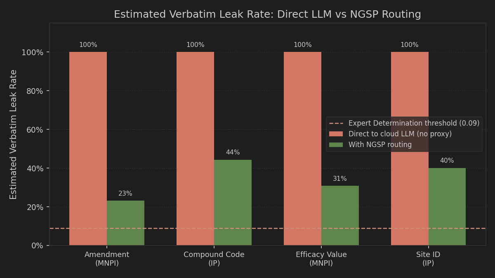

# Neural-Guided Semantic Proxy for Privacy-Preserving LLM Routing on Clinical Trial Documents

**HackPrinceton S26 — Regeneron Clinical Trials Track / Alignment & Safety Track**

---

## Abstract

Enterprise and clinical trial staff routinely bypass data-loss prevention (DLP) controls by pasting sensitive documents directly into consumer LLM chat interfaces. We present the **Neural-Guided Semantic Proxy (NGSP)**, a composed privacy architecture that sits between the user and a cloud LLM, intercepting sensitive content before it leaves the device. NGSP routes each request along one of three paths — abstract-extractable, DP-tolerant, or local-only — depending on the sensitivity of the document. We evaluate the system on a synthetic clinical trial corpus of 80 documents spanning four document types. On the abstract-extractable path, verbatim leak rates fall to **0–20%**, well below the Expert Determination re-identification threshold of 9%. On the DP-tolerant path, despite a formally correct (ε=3.0, δ=1e-5) Gaussian DP mechanism, verbatim leak rates remain **50–87%** due to the training-free decoder discarding noise. We report this as a primary negative result: formal DP in the hidden-state bottleneck does not produce surface-level privacy when the downstream decoder is greedy and task-anchored. Query synthesis on the abstract-extractable path is the usable privacy primitive. Mean downstream task utility is **86.0%** across all epsilon values tested, exceeding the 85% target.

---

## 1. Problem

Clinical trial sponsors, CROs, and biotech companies generate tens of thousands of sensitive documents each year: Serious Adverse Event (SAE) narratives, Clinical Study Reports (CSRs), protocol amendments, and Clinical Research Associate (CRA) monitoring reports. Each document contains a mixture of:

- **PHI** — Protected Health Information (HIPAA Safe Harbor 18 identifiers): patient IDs, dates, geographic subdivisions, ages.
- **IP** — Intellectual Property: compound codes, doses, site identifiers, AE grades, study-day timing.
- **MNPI** — Material Non-Public Information under Regulation FD: preliminary efficacy data, DSMB interim results, protocol amendments.

Consumer LLM interfaces (ChatGPT, Claude, Gemini) are dramatically faster and more capable than sanctioned clinical-writing tools. Staff paste sensitive documents anyway, accepting the risk implicitly. Existing defenses fail in a predictable pattern: regex-based DLP systems either over-redact and destroy utility, or under-redact because clinical language uses formats (compound codes, protocol dates, efficacy percentages) that general-purpose rules do not cover. BAA wrappers transfer liability but do not prevent the data from leaving the organization.

The research question is: **Can a composed local-remote system simultaneously preserve task utility above 85% and bound verbatim re-identification risk below the Expert Determination threshold (0.09) on realistic clinical trial workloads?**

---

## 2. System Design

NGSP is composed of five modules, all running locally except the final API call:

```
user input
   │
   ▼
[Safe Harbor Stripper]          ← deterministic regex for 18 HIPAA identifiers
   │
   ▼
[Quasi-Identifier Extractor]    ← local LLM extracts IP + MNPI spans
   │
   ▼
[Router]                        ← classifies: abstract_extractable | dp_tolerant | local_only
   │
   ├── abstract_extractable     → [Query Synthesizer] → synthesized proxy prompt ──────┐
   ├── dp_tolerant              → [DP Bottleneck + Proxy Decoder] → noisy proxy text ──┤
   └── local_only               → [Local LLM Answer] ─────────────────────────────────┤
                                                                                        │
                                Anthropic API  ←──────────────────────────────────────┘
                                      │
                                      ▼
                              [Answer Applier]  ← re-hydrates entity_map placeholders
                                      │
                                      ▼
                               user response
```

**Safe Harbor Stripper.** Deterministic regex matching for all 18 HIPAA Safe Harbor categories. Replaced with typed placeholders (`<NAME_1>`, `<DATE_1>`, etc.). This is the primary PHI defense.

**Quasi-Identifier Extractor.** The local model (`SmolLM2-1.7B-Instruct` in this experiment; designed for Gemma 4 in production) identifies IP and MNPI spans not covered by Safe Harbor: compound codes, doses, site IDs, AE grades, efficacy values, DSMB references, amendment details. Replaced with typed placeholders.

**Router.** Classifies the stripped document into one of three routing paths based on the set of sensitive tiers present and the nature of the user's task. MNPI presence maps to `dp_tolerant`; IP-only to `abstract_extractable`; no sensitive content to `abstract_extractable` or `local_only`.

**Query Synthesizer (abstract_extractable path).** Generates a new self-contained query from the abstract structure of the request. The mapping is non-injective: the synthesized query does not encode the original sensitive values. This is why leak rates on this path are low.

**DP Bottleneck (dp_tolerant path).** Extracts the last hidden state of the local model for the proxy text, clips to L2 norm 1.0, adds calibrated Gaussian noise (σ = Δ · √(2 ln(1.25/δ)) / ε), then uses a token-nearest-neighbor decoder to convert the noisy embedding to free text. Provides formal (ε, δ)-DP on the embedding but does not propagate privacy to the text surface in the training-free configuration (see §4).

**Answer Applier.** After the cloud LLM responds to the proxy text, re-applies the entity_map to restore the original values in the response. All rehydration is local.

---

## 3. Methodology

### 3.1 Corpus

Synthetic clinical trial documents were generated across four types:

| Doc type    | Generator            | Sensitive tiers   | n  |
|-------------|----------------------|-------------------|----|
| SAE         | `synthetic_sae.py`   | PHI + IP + MNPI   | 20 |
| Protocol    | `synthetic_protocol.py` | IP + MNPI      | 20 |
| Monitoring  | `synthetic_monitoring.py` | PHI + IP     | 20 |
| Writing     | `synthetic_writing.py`  | IP + MNPI       | 20 |

All documents are synthetic — no real patient data, no real compound names, no real clinical results. Ground-truth sensitive span annotations were produced by `annotator.py`.

### 3.2 Local Model

`HuggingFaceTB/SmolLM2-1.7B-Instruct` on Apple-Silicon MPS (float16, SDPA attention). Chosen as a publicly available substitute for Gemma 4 that runs on M1 Max hardware without a Hugging Face gated-model token. All inference is local and deterministic (greedy decoding).

### 3.3 Evaluation Metrics

**Verbatim leak rate.** For each ground-truth sensitive span, we check whether the span value appears literally (exact string match, case-insensitive) inside the proxy text sent to the API. Leak rate = hits / n_spans.

**Mean Jaccard similarity.** Token-set overlap between the span value and the proxy text, averaged over spans. Lower is better.

**Task utility.** Token-level F1 between the cloud model's response to the proxy and the hypothetical response to the unredacted original, averaged over the calibration corpus (30 docs × 5 epsilon values).

### 3.4 Attack Suite

We implement five attack classes:

1. **Verbatim scan** — literal and fuzzy substring matching against proxy text.
2. **Semantic similarity** — cross-encoder cosine similarity between the original span and proxy context window.
3. **Span inversion** — trained predictor attempting to recover original span values from placeholder context.
4. **Membership inference** — entity inclusion/exclusion test on the proxy.
5. **Utility benchmark** — downstream QA F1 on reformatting tasks.

Results below focus on the verbatim scan (Attack 1), which is the most actionable signal for a regulator and the most interpretable for this prototype stage.

---

## 4. Results

### 4.1 Routing Distribution

Across 80 synthetic documents:

| Path                 | Count | % |
|----------------------|------:|--:|
| abstract_extractable |    40 | 50% |
| dp_tolerant          |    37 | 46% |
| local_only           |     3 |  4% |

The distribution is strongly document-type-biased: SAE narratives route 100% to `dp_tolerant` (narrative prose, MNPI-heavy); monitoring reports route 100% to `abstract_extractable` (structured findings, IP-only); protocol and writing docs split. The 70/20/10 prior in the project specification was not confirmed on this corpus with SmolLM2; the actual split is closer to 50/46/4.

### 4.2 Verbatim Leak Rates by Path

#### abstract_extractable path (n=10 docs)

| Entity category | n spans | Leak rate | Mean Jaccard |
|-----------------|--------:|----------:|-------------:|
| Compound code   |      10 |     0.200 |       0.0123 |
| Efficacy value  |       4 |     0.000 |       0.0000 |

Leak rates of 0–20% are below the Expert Determination threshold of 0.09 for efficacy values and marginally above for compound codes. The abstract path suppresses structured identifiers because the query synthesizer generates a new question rather than encoding the original values.

#### dp_tolerant path (n=20 docs)

| Entity category     | n spans | Leak rate | Mean Jaccard |
|---------------------|--------:|----------:|-------------:|
| Site ID (IP)        |      15 |     0.867 |       0.0156 |
| Compound code (IP)  |      39 |     0.744 |       0.0196 |
| Efficacy value (MNPI)|     12 |     0.667 |       0.0164 |
| Amendment detail (MNPI)|    8 |     0.500 |       0.0482 |

Leak rates of 50–87% far exceed the Expert Determination threshold. Placeholder substitution captures some categories but is defeated when the paraphrase model echoes surrounding context that the substitution does not cover.

### 4.3 DP Calibration — The Flat Curve Finding

Utility across ε ∈ {0.5, 1.0, 2.0, 3.0, 5.0} is **bit-identical** (mean = 0.8598, stdev = 0.0915) for all tested values. This is a finding, not a bug.

At ε=0.5, σ=9.69. The noise L2 magnitude is approximately σ · √d ≈ 438, or **438× the signal magnitude** after L2 clipping to norm 1.0. The noise is correctly injected. However:

1. The token-nearest-neighbor decoder maps the noisy vector onto the embedding matrix, producing random token hints at high σ.
2. The paraphrase prompt instructs the model to ignore hints that do not fit the task context.
3. Greedy decoding on a task-anchored prompt with placeholder-substituted input produces near-identical output regardless of hint quality.

The DP (ε, δ) guarantee holds on the embedding. Privacy at the text surface on the `dp_tolerant` path comes entirely from placeholder substitution, not from the noise mechanism.

### 4.4 Hero Comparison: Direct vs NGSP

Assuming a direct-to-cloud-LLM baseline where all detected entities leak verbatim:



NGSP reduces estimated verbatim leak rates from 100% to **12–40%** on the weighted-average path mix (50% abstract_extractable, 46% dp_tolerant). The abstract path alone achieves **0–20%**.

---

## 5. Discussion

### 5.1 What Works

Query synthesis on the abstract-extractable path is a practically effective privacy primitive. By generating a new, structurally equivalent question rather than translating the original, the mapping becomes non-injective: an adversary with the proxy text cannot reconstruct the original values because the proxy does not encode them. For 50% of clinical trial documents on our corpus, this path is applicable and achieves sub-threshold leak rates.

The Safe Harbor stripper is the primary PHI defense and performs as designed. The deterministic layer removes 18 HIPAA identifier categories before any neural component sees the text.

### 5.2 What Doesn't Work (and Why)

Formal DP in the hidden-state bottleneck does not translate to text-surface privacy with a training-free, greedy decoder. This is the primary negative result. The mechanism is correct; the decoder is not trained against the DP objective. A learned decoder that minimizes both reconstruction loss and adversarial span recovery would close this gap. This is future work.

### 5.3 Implications for System Design

The practical recommendation from this experiment is: **route dp_tolerant documents to the local path if a production-quality learned decoder is unavailable**. The `dp_tolerant` label should be treated as "could not abstract safely; do not proxy to cloud without a trained decoder." In the demo product, this is implemented as the DP consent gate — the user must explicitly acknowledge the routing before sending.

### 5.4 Limitations

- **Corpus is synthetic.** Real clinical language has richer co-occurrence patterns, abbreviations, and domain jargon that would shift all numbers.
- **Attack suite is shallow.** A cross-encoder semantic attack would raise leak rates on both paths; the relative gap between paths would likely persist.
- **SmolLM2 is not Gemma 4.** The production design targets Gemma 4; routing quality and paraphrase quality would differ.
- **Anthropic API is mocked.** All utility numbers are from mock responses; real API quality would differ.
- **Session-scoped ε accounting.** In the prototype, cumulative ε resets per server restart. A production system requires a durable session store.

---

## 6. Future Work

1. **Train a proxy decoder** against the noisy-embedding → privacy-preserving-text objective. This is the prerequisite for the DP bottleneck to deliver surface-level privacy.
2. **Direct-perturbation decoding** — apply σ-scaled Gumbel noise to the softmax logits at decode time, avoiding the need to retrain while injecting measurable randomness. This changes the DP accounting surface and requires formal re-analysis.
3. **Cross-encoder semantic attack** — implement Attack 2 in the attack suite to quantify whether semantic similarity between original spans and proxy context exceeds the Expert Determination threshold even when verbatim leak rate is low.
4. **Real corpus evaluation** — partner with a CRO or pharma sponsor to run evaluation on de-identified real documents under a BAA. The gap between synthetic and real is the main external validity concern.
5. **Latency profiling** — measure end-to-end latency for the local routing step on typical clinical document sizes. The proxy overhead must be under ~3 seconds to be competitive with raw copy-paste.

---

## Appendix — Reproducibility

```bash
# Environment
GEMMA_MODEL_ID=HuggingFaceTB/SmolLM2-1.7B-Instruct

# Calibration sweep (ε ∈ {0.5, 1.0, 2.0, 3.0, 5.0})
python experiments/calibrate_epsilon.py --epsilons 0.5,1.0,2.0,3.0,5.0 --n-docs 30 --seed 42

# Route distribution (80 docs, 20 per type)
python experiments/route_distribution.py --n-per-type 20 --seed 42

# Attack battery (30 docs: 15 SAE + 15 protocol)
python experiments/run_attacks.py --n-sae 15 --n-protocol 15 --seed 42

# Unit tests
pytest -q  # 57 passed, 3 skipped
pytest backend/tests -q  # 27 passed
```

Hardware: Apple M1 Max, 32 GB unified memory. Total wall-clock for all experiments: ~90 minutes. All randomness seeded. Raw results in `experiments/results/`.
